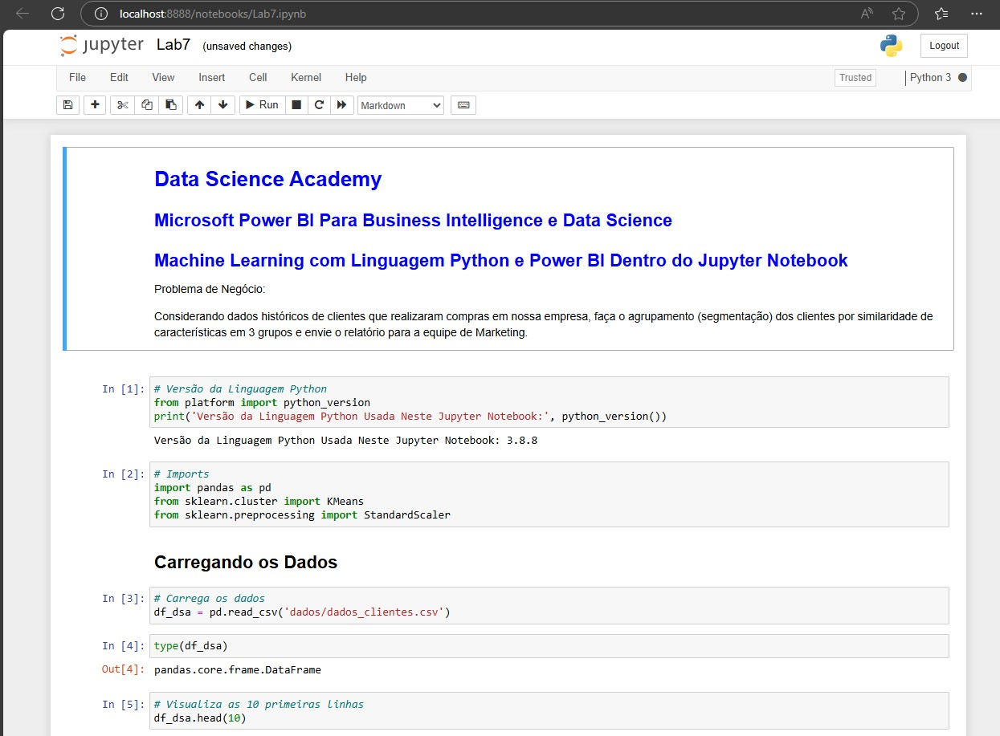
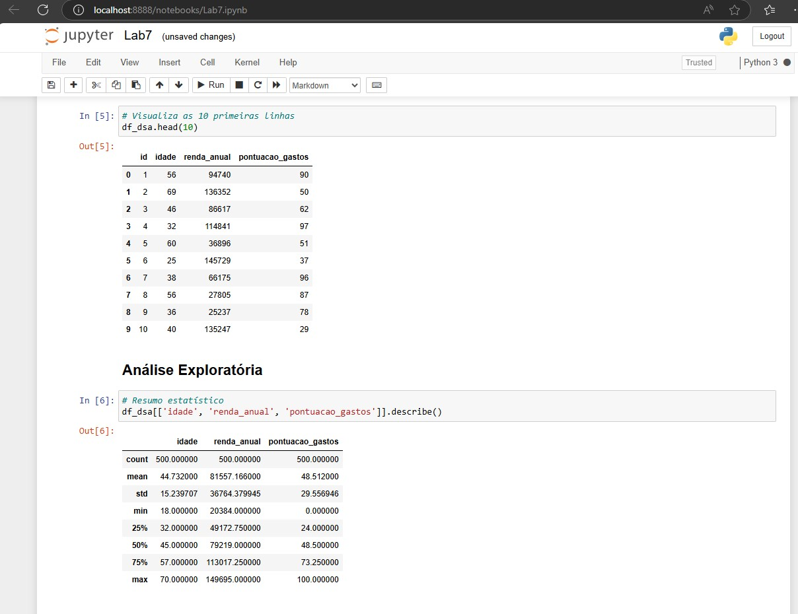
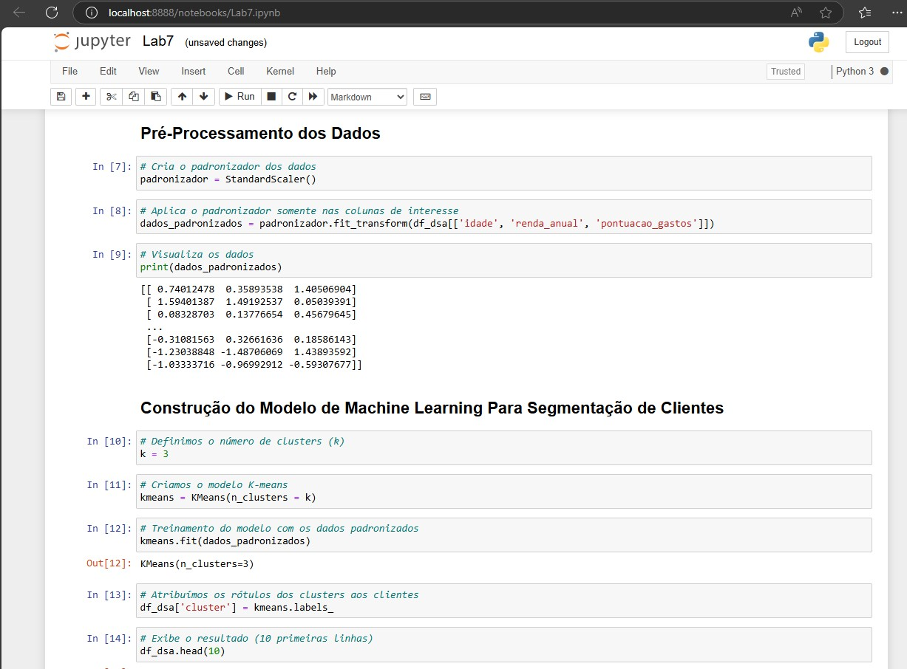
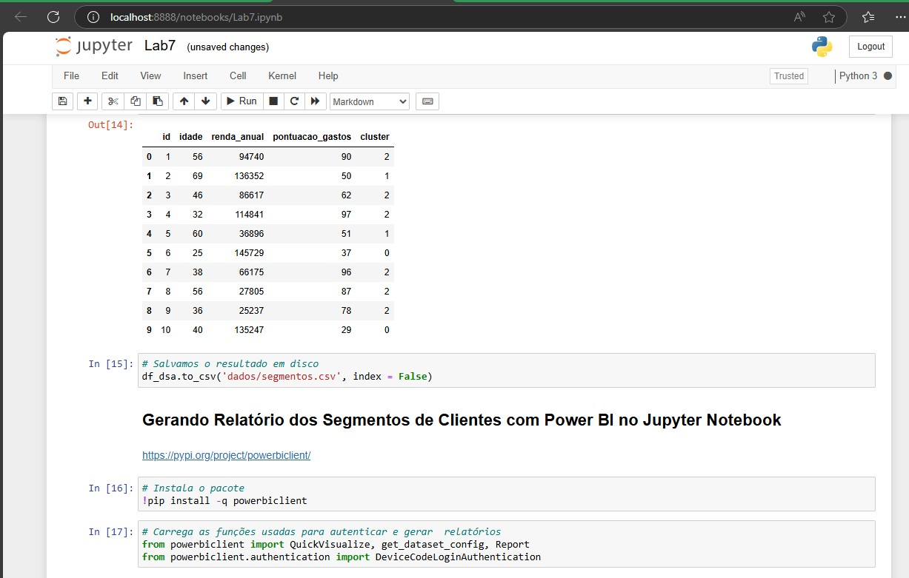
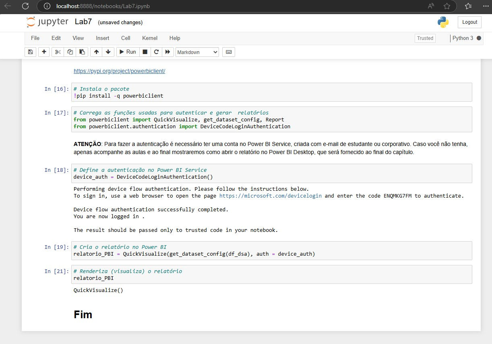
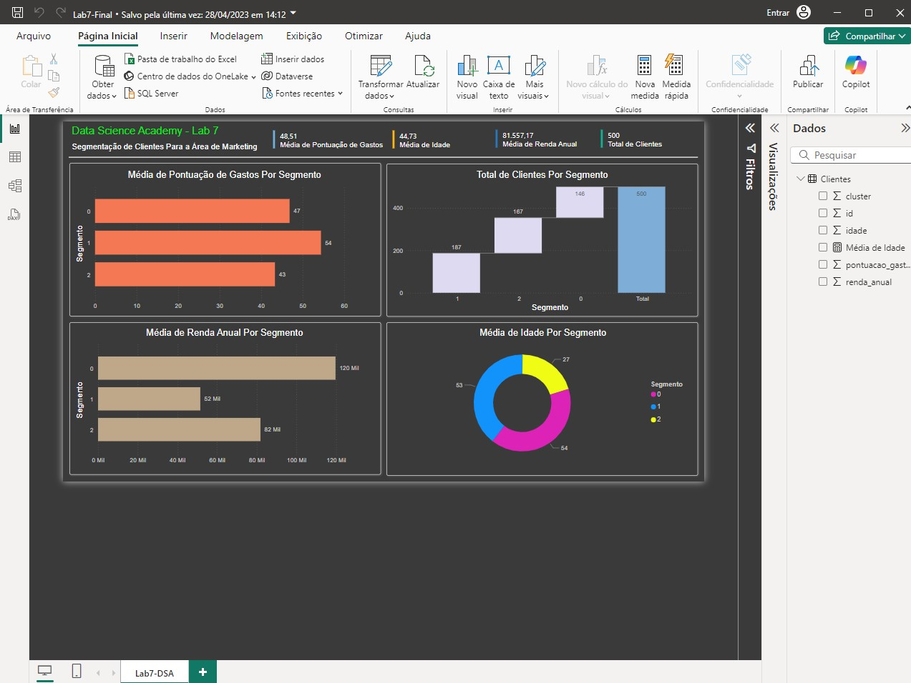

# MachineLearningPythonPowerBI

# Sobre o projeto
 
Neste pequeno projeto abordaremos 3 segmentos de clientes para campanhas de marketing, utilizaremos Machine Learning para preparar a fonte de dados com linguagem Python. 
Este projeto foi feito a partir do modelo do curso realizado pela Data Science Academy ([(https://www.datascienceacademy.com.br/)]).

Este projeto consiste no uso da plataforma Jupyter Notebook para uso da linguagem Python, todo passo a passo para o preparo da fonte de dados em Machine Learning, até o ETL e abertura no final e a visualização do relatório no Power BI workspace e desktop.

## Parte 1 tela Jupiter Notebook

## Parte 2 tela Jupiter Notebook

## Parte 3 tela Jupiter Notebook

## Parte 4 tela Jupiter Notebook

## Parte 5 tela Jupiter Notebook

## Parte 6 tela do Relatório PowerBI desktop consumindo dos dados prontos.

# Tecnologias utilizadas
Python
Jupyter Notebook (Plataforma para uso Python)
Power BI

# Autor

Carlos de Camargo Penteado Neto

[https://www.linkedin.com/in/carlos-de-camargo-penteado-neto-83974430]
